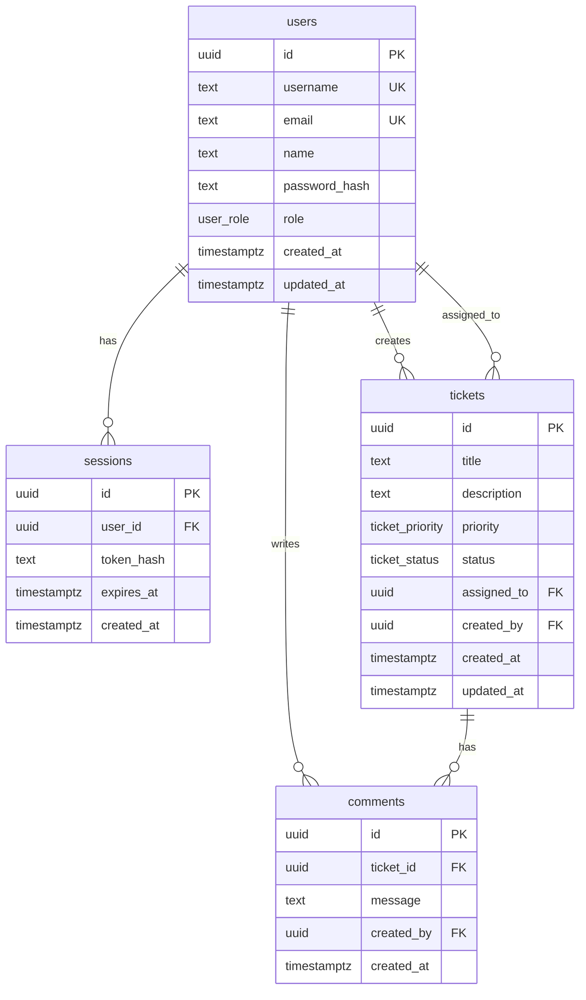

# Data Model

## Entity Relationship Diagram



## Enums

### user_role
| Value | Description |
|-------|-------------|
| admin | Full access, user management |
| agent | All tickets, create/update/comment |
| user | Own tickets + assigned tickets |

### ticket_status
| Value | Description |
|-------|-------------|
| open | Initial state |
| in_progress | Being worked on |
| resolved | Fix applied, awaiting close |
| closed | Terminal — completed |
| cancelled | Terminal — abandoned |

### ticket_priority
| Value |
|-------|
| low |
| medium |
| high |
| urgent |

## Tables

### users

| Column | Type | Constraints |
|--------|------|-------------|
| id | uuid | PK, default random |
| username | text | NOT NULL, UNIQUE |
| email | text | NOT NULL, UNIQUE |
| name | text | NOT NULL |
| password_hash | text | NOT NULL |
| role | user_role | NOT NULL, default `user` |
| created_at | timestamptz | NOT NULL, default now |
| updated_at | timestamptz | NOT NULL, auto-update |

**Index:** `users_username_idx` on username

**Schema file:** `packages/db/src/schema/users.ts`

### sessions

| Column | Type | Constraints |
|--------|------|-------------|
| id | uuid | PK |
| user_id | uuid | FK → users.id, ON DELETE CASCADE |
| token_hash | text | NOT NULL |
| expires_at | timestamptz | NOT NULL |
| created_at | timestamptz | NOT NULL |

**Indexes:** user_id, token_hash, expires_at

Used for refresh token storage and logout invalidation.

### tickets

| Column | Type | Constraints |
|--------|------|-------------|
| id | uuid | PK |
| title | text | NOT NULL |
| description | text | NOT NULL |
| priority | ticket_priority | NOT NULL, default `medium` |
| status | ticket_status | NOT NULL, default `open` |
| assigned_to | uuid | FK → users.id, ON DELETE SET NULL, nullable |
| created_by | uuid | FK → users.id, ON DELETE RESTRICT |
| created_at | timestamptz | NOT NULL |
| updated_at | timestamptz | NOT NULL, auto-update |

**Indexes:** status, assigned_to, created_by, created_at, priority

**Schema file:** `packages/db/src/schema/tickets.ts`

### comments

| Column | Type | Constraints |
|--------|------|-------------|
| id | uuid | PK |
| ticket_id | uuid | FK → tickets.id, ON DELETE CASCADE |
| message | text | NOT NULL |
| created_by | uuid | FK → users.id, ON DELETE RESTRICT |
| created_at | timestamptz | NOT NULL |

**Indexes:** ticket_id, created_at

**Schema file:** `packages/db/src/schema/comments.ts`

## State Machine

```
open         → in_progress, cancelled
in_progress  → resolved, cancelled
resolved     → closed
closed       → (no transitions)
cancelled    → (no transitions)
```

Enforced at API layer only — database does not constrain status transitions.

## Seed Data

**File:** `packages/db/src/seed.ts`

- 5 users: admin, agent1, agent2, user1, user2 (password: `Password123!`)
- 8 tickets across all statuses and priorities
- Comments on select tickets

## Migration

**File:** `packages/db/migrations/0000_optimal_lady_bullseye.sql`

Run: `pnpm db:migrate`

## Extensions from Assignment

Assignment User entity had: id, name, email, role (seeded only).

This implementation adds:
- `username` — unique login identifier
- `password_hash` — bcrypt hashed password
- `sessions` table — server-side session store for logout

These are Stretch-tier auth additions documented in [`requirements-analysis.md`](requirements-analysis.md).
