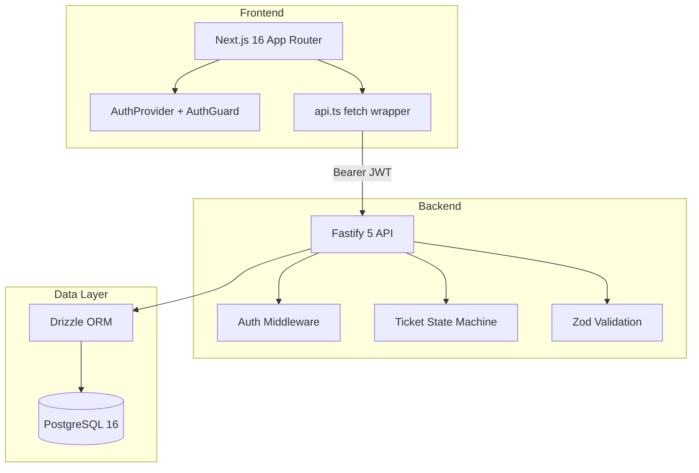

# Design Notes

## Architecture Overview



**Monorepo layout:**
- `apps/web` — Next.js frontend (port 3000)
- `apps/api` — Fastify REST API (port 4000)
- `packages/db` — Drizzle schema, migrations, seed
- `packages/shared` — Zod schemas, state machine constants

## Frontend Design

- **Framework:** Next.js 16 App Router, React 19, Tailwind CSS 4
- **Auth:** Client-side `AuthProvider` stores access token in memory; refresh token in httpOnly cookie set by API
- **Route protection:** `AuthGuard` component wraps protected layouts — redirects to `/login` if unauthenticated
- **API client:** `apps/web/src/lib/api.ts` — centralized fetch with token injection and 401 refresh retry
- **Pages:** login, register, ticket list, ticket create, ticket detail, admin users
- **Error states:** API errors surfaced as inline messages; 409 status transitions show transition error text

## Backend Design

- **Framework:** Fastify 5 with TypeScript, ESM modules
- **Route modules:** `auth.ts`, `tickets.ts`, `users.ts`
- **Middleware:** `createAuthenticate()` verifies JWT; `authorize()` checks role
- **Business rules:** State machine in `packages/shared` constants; enforced in `PATCH /tickets/:id/status` only
- **Status bypass prevention:** General `PATCH /tickets/:id` does not accept `status` field
- **OpenAPI:** Swagger UI at `/docs` via `@fastify/swagger`

## Database Design

- **PostgreSQL 16** with Drizzle ORM
- **Tables:** users, sessions, tickets, comments
- **Enums:** user_role, ticket_status, ticket_priority
- **Indexes:** status, assigned_to, created_by, created_at, priority on tickets; ticket_id on comments
- **Cascade rules:** comments cascade on ticket delete; sessions cascade on user delete; assigned_to set null on user delete

## Validation Strategy

All input validation uses **Zod schemas in `packages/shared`** — same schemas used by API routes and can be imported by frontend forms.

| Schema | Used by |
|--------|---------|
| `registerSchema` | POST /auth/register |
| `loginSchema` | POST /auth/login |
| `createTicketSchema` | POST /tickets |
| `updateTicketSchema` | PATCH /tickets/:id |
| `updateTicketStatusSchema` | PATCH /tickets/:id/status |
| `createCommentSchema` | POST /tickets/:id/comments |
| `ticketQuerySchema` | GET /tickets query params |
| `updateUserRoleSchema` | PATCH /users/:id/role |

Invalid input returns HTTP 400 with `{ error, details }` field-level errors.

## Error Handling Strategy

| HTTP Code | When |
|-----------|------|
| 400 | Validation failure, assignee not found |
| 401 | Missing/invalid token, bad credentials |
| 403 | RBAC access denied |
| 404 | Ticket/user not found |
| 409 | Invalid status transition, duplicate username/email |
| 500 | Unhandled server error (logged, generic message to client) |

Frontend displays error messages from API response `error` field. Status transition errors include human-readable transition description.

## State Machine Design

Centralized in `packages/shared/src/constants/index.ts`:

```
open         → in_progress, cancelled
in_progress  → resolved, cancelled
resolved     → closed
closed       → (terminal)
cancelled    → (terminal)
```

`validateStatusTransition()` throws on invalid transition; API catches and returns 409.

## RBAC Design

| Role | Ticket access | Modify | Status change | User mgmt |
|------|--------------|--------|---------------|-----------|
| admin | All | All | All | Yes |
| agent | All | All | All | No |
| user | Own + assigned | Own only | Own only | No |

Enforced in route handlers via `canAccessTicket()` and `canModifyTicket()` helpers.

## Testing Strategy Link

See [`test-strategy.md`](test-strategy.md) for unit and integration test scope.
