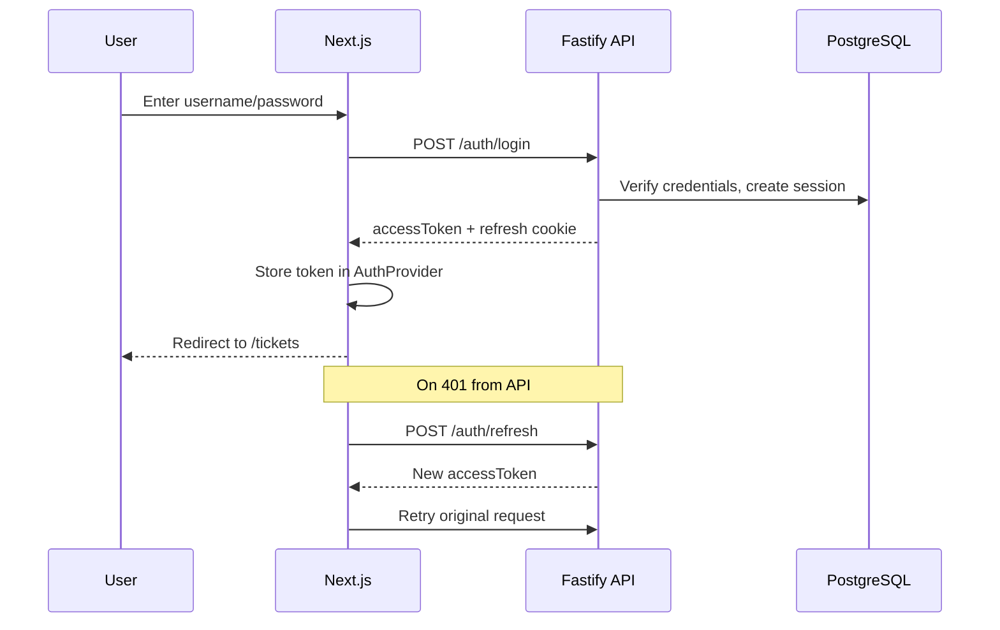

# UI Flow

## Page Map

| Route | Access | Purpose |
|-------|--------|---------|
| `/` | Public | Redirect to `/tickets` or `/login` |
| `/login` | Public | Username/password login |
| `/register` | Public | New user registration |
| `/tickets` | Authenticated | Ticket list with search/filter |
| `/tickets/new` | Authenticated | Create ticket form |
| `/tickets/[id]` | Authenticated | Ticket detail, edit, status, comments |
| `/admin/users` | Admin only | User role management |

## Auth Flow



**Route protection:** `AuthGuard` in `apps/web/src/components/auth-guard.tsx` wraps protected layouts. Unauthenticated users redirect to `/login`.

## Journey 1: Create Ticket

1. User navigates to `/tickets/new`
2. Fills form: title, description, priority, optional assignee
3. Client validates required fields
4. `POST /tickets` with Bearer token
5. On success → redirect to `/tickets/[id]`
6. On 400 → show field errors inline

## Journey 2: List and Search Tickets

1. User lands on `/tickets`
2. Page loads with default sort (createdAt desc)
3. User types keyword → `q` param sent to API
4. User selects status filter → `status` param sent
5. Stretch: priority filter, assignee filter, sort, pagination controls
6. Results render in table with status badges and priority labels
7. Click row → navigate to `/tickets/[id]`

## Journey 3: View and Update Ticket

1. User opens `/tickets/[id]`
2. Page fetches ticket detail + comments in parallel
3. User edits title/description/priority/assignee
4. `PATCH /tickets/:id` on save
5. Success → UI updates; error → message shown

## Journey 4: Change Status (State Machine)

1. On ticket detail page, status dropdown shows only valid next statuses
2. Valid options derived from `getValidNextStatuses(currentStatus)` in shared package
3. User selects new status
4. `PATCH /tickets/:id/status` with `{ status }`
5. On 409 → show error: "Cannot transition from X to Y"
6. On 200 → update badge and refresh valid options

**Frontend constraint:** Dropdown only shows valid transitions — but backend is authoritative and rejects invalid ones with 409.

## Journey 5: Add Comment

1. On ticket detail page, user types in comment textarea
2. `POST /tickets/:id/comments`
3. On success → comment appended to list with author name and timestamp
4. On 400 → show validation error

## Journey 6: Admin Role Management

1. Admin navigates to `/admin/users`
2. Non-admin users see access denied or redirect
3. Table lists all users with current role
4. Admin selects new role from dropdown
5. `PATCH /users/:id/role`
6. On success → role badge updates

## Error State Handling

| Scenario | UI behavior |
|----------|-------------|
| 400 validation | Field-level or banner error from `details` |
| 401 unauthorized | Attempt token refresh; if fails, redirect to login |
| 403 forbidden | "Access denied" message |
| 404 not found | "Ticket not found" page/message |
| 409 invalid transition | Show transition error text from API |
| Network error | Generic "Something went wrong" with retry option |

## Component Structure

```
apps/web/src/
├── app/
│   ├── layout.tsx          # Root layout with AuthProvider
│   ├── page.tsx            # Home redirect
│   ├── login/page.tsx
│   ├── register/page.tsx
│   ├── tickets/
│   │   ├── layout.tsx      # AuthGuard wrapper
│   │   ├── page.tsx        # List
│   │   ├── new/page.tsx    # Create
│   │   └── [id]/page.tsx   # Detail
│   └── admin/
│       ├── layout.tsx      # Admin AuthGuard
│       └── users/page.tsx
├── components/
│   ├── auth-provider.tsx
│   ├── auth-guard.tsx
│   ├── navbar.tsx
│   └── ui.tsx
└── lib/
    └── api.ts              # API client
```
